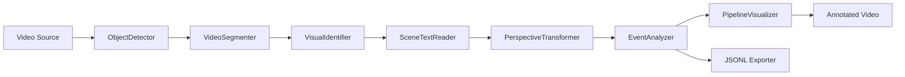

# Architecture Documentation

## Overview

This repository implements a modular video analysis pipeline focused on **production maintainability** and **incremental extensibility**.
The system runs in deterministic mock mode by default, allowing local validation without model weights.

## Core Architectural Principles

1. Single responsibility per module
2. Contract-driven data flow between stages
3. Deterministic behavior in development mode
4. Progressive enhancement (mock -> real models)
5. Observability through structured telemetry (`JSONL`)

## High-Level Flow

## Main Components

### 1. Orchestration (`src/core/pipeline.py`)

`VisionPipeline` coordinates all processing stages frame-by-frame:
- detection
- tracking/segmentation
- clustering refresh (configurable interval)
- OCR refresh (configurable interval)
- world-coordinate projection
- temporal event analysis
- annotated rendering
- telemetry export

### 2. Processing Modules

- `src/detection/detector.py`
  - deterministic mock detections with validation and confidence filtering
- `src/segmentation/segmenter.py`
  - IoU-based ID association with missing-frame tolerance
- `src/clustering/identifier.py`
  - deterministic embeddings from resized crops and KMeans clustering
- `src/ocr/reader.py`
  - mock OCR heuristic with track-level cache
- `src/homography/transformer.py`
  - robust homography computation and point transforms
- `src/events/analyzer.py`
  - state machine for dwell + zone entry/exit events with cooldown
- `src/visualization/drawer.py`
  - modern HUD overlay with readable hierarchy and event feed

### 3. UI Layer (`src/ui/dashboard.py`)

A Streamlit interface provides:
- video upload
- pipeline parameter tuning
- zone definition
- execution trigger
- output video preview
- event table visualization

## Data Contracts

Inter-stage payloads use normalized dictionaries with stable keys:

- Detection:
  - `bbox`, `label`, `score`, `class_id`
- Track:
  - `id`, `bbox`, `mask`, `class_id`, `label`, optional `cluster_id`, `ocr_text`, `world_position`
- Event:
  - `frame`, `type`, `object_id`, `details`, `severity`

## Performance and Scalability Considerations

- Intervals (`ocr_interval`, `clustering_interval`) reduce unnecessary heavy calls
- Track cache and OCR cache reduce recomputation
- JSONL export is append-only and stream-friendly
- Mock mode keeps CI and local iteration fast

## Extension Points

1. Replace `ObjectDetector` mock with RF-DETR inference
2. Replace `VideoSegmenter` mock masks with SAM2 masks
3. Add custom event policies in `EventAnalyzer`
4. Add dashboard analytics charts from JSONL history
5. Add distributed processing for multi-camera scenarios

## Testing Strategy

- Unit tests for detector, segmenter, clustering
- New tests for event analyzer behavior
- Integration-like tests for pipeline execution and artifacts
