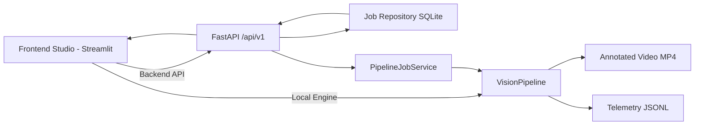

# Architecture Documentation

## 1. System Purpose

The platform delivers a modular video intelligence workflow for operational scenarios such as sports analytics, retail monitoring, and security supervision. It supports both local execution and API-driven orchestration.

## 2. High-Level Architecture

## 3. Architectural Decisions

1. **Dual execution strategy (local + remote API)**
   - Local mode accelerates prototyping.
   - API mode enables separation of concerns, role-based access, and service-style deployment.

2. **Job-based backend processing**
   - Long-running pipeline tasks are represented as jobs with lifecycle states.
   - Job metadata is persisted in SQLite for auditability and recovery.

3. **Deterministic mock mode**
   - All core modules can operate in deterministic mock mode to keep tests and development reproducible.

4. **Structured telemetry contract**
   - JSONL output is append-only and machine-readable.
   - Event and frame records are unified for dashboard analytics and external integrations.

## 4. Layers and Responsibilities

### Frontend Layer (`src/ui`)
- `dashboard.py`: application flow and user interaction.
- `theme.py`: design tokens and accessibility modes.
- `components/panels.py`: reusable visual blocks/charts.
- `analytics.py`: telemetry parsing, filtering, summarization.
- `api_client.py`: REST integration for backend execution.
- `state.py`: session and run-history state.

### API Layer (`src/api`)
- `app.py`: versioned REST endpoints, middleware, validation, responses.
- `security.py`: API-key authentication and role-based authorization.
- `repository.py`: SQLite persistence for job lifecycle.
- `service.py`: pipeline orchestration for submitted jobs.
- `schemas.py`: request/response contracts.

### Core Processing Layer (`src/core` + domain modules)
- `VisionPipeline` coordinates detector, segmenter, identifier, OCR, homography, events, and visualizer.
- `JsonlExporter` writes telemetry with stable record contracts.

## 5. API Contract (`/api/v1`)

### Endpoints
- `GET /api/v1/health`
- `POST /api/v1/jobs` (multipart upload + params)
- `GET /api/v1/jobs`
- `GET /api/v1/jobs/{job_id}`
- `GET /api/v1/jobs/{job_id}/events`
- `GET /api/v1/jobs/{job_id}/artifacts/video`
- `GET /api/v1/jobs/{job_id}/artifacts/analytics`

### Auth Model
- Header: `X-API-Key`
- Roles:
  - `admin`: read/write jobs + artifact access
  - `operator`: read/write jobs + artifact access
  - `viewer`: read-only jobs/artifacts

### Security Controls
- input validation and bounded parameters
- file extension and upload-size guardrails
- role-based permission checks
- request-id middleware for traceability

## 6. Data and Integrity

- Job metadata is stored in SQLite (`runtime/api_jobs.sqlite3`).
- Artifacts are stored under `runtime/uploads` and `runtime/outputs`.
- JSON payloads and zone definitions are serialized consistently to preserve replayability and operational audit.

## 7. Observability and Error Handling

- Request ID and response time headers are returned by middleware.
- Structured failures are surfaced with consistent error responses.
- Job failures are persisted with error message and state transition to `failed`.

## 8. Performance Strategy

- OCR and clustering are frame-interval based (configurable).
- Backend jobs can run asynchronously, with client-side polling.
- Cached cluster/OCR assignments reduce repeated computation.

## 9. Test Strategy

- Unit tests for core domain modules.
- API tests for auth and job lifecycle.
- UI utility tests for parser and analytics modules.
- Deterministic mock behavior keeps test runs stable across environments.

## 10. Future Extensions

1. Queue backend with Redis/Celery for distributed workers.
2. Persistent object storage (S3/MinIO) for artifacts.
3. OAuth2/JWT and tenant-aware authorization.
4. Metrics export (Prometheus/OpenTelemetry).
5. GraphQL facade for analytics consumers.
